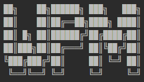

# WordPress Manager

## Description


This tool lets you install and configure a Wordpress site and create its database in less than 5 minutes, and start it up without Apache or Ngnix.

The aim of this project was to avoid the need for tools such as Wamp, Lamp, etc. or a local web server (apache, nginx) to serve a WordPress project.

This project is currently supported for Ubuntu, Debian, and WSL(Ubuntu, Debian).

## Roadmap

### Prochaines releases :

- add docker support, so you will don't need to install a local database.
- Add native Windows support
- Added native IOS support
- Update/Upgrade system

### Next improvements :

- Improved code structure
- Add PHPStan
- CI/CD

## Install

```
curl -JOL https://github.com/EBosset/wpmanager/releases/download/1.0.0/wpm
sudo chmod +x wpm
sudo mv wpm /usr/local/bin
```

## Requirements

- WP-CLI
- MySQL
- PHP >=7.4 | ^8.2

## Usage

### Interactive usage

```
wpm
```

### Available options (optional)

| Short | Long                          | Description                                  |
|-------|-------------------------------|----------------------------------------------|
| -l    | --locale[=LOCALE]             | WP locale for the project [default: "fr_FR"] |
| -u    | --db-user[=DB-USER]           | Mysql user                                   |
| -p    | --db-pass[=DB-PASS]           | Mysql password                               |
| -x    | --table-prefix[=TABLE-PREFIX] | Prefix for wordpress tables [default: "wp_"] |
| -o    | --db-host[=DB-HOST]           | Project host [default: "localhost"]          |
| -t    | --title[=TITLE]               | Site title                                   |
| -y    | --username[=USERNAME]         | Site admin username                          |
| -s    | --password[=PASSWORD]         | Site admin password                          |
| -m    | --email[=EMAIL]               | Site admin email                             |
| -h    | --help                        | Display help                                 |


## Contribution

Any contribution is welcome !

See [Roadmap](#roadmap) to know our intentions

Do not hesitate to open an issue


## Credits

Thanks to [John Khan](https://github.com/johnkhansrc) for his contribution